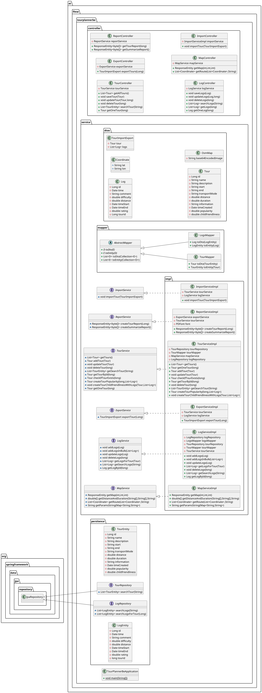

# TourPlannerBE
The goal of this project was to create a tool to plan an share tours. You are able to create a tour and add some data. The tours are managed in a list and everyone is allowed to create a new tour and edit or delete tours that already exists. To share your own expireance you can create a log to the tour that you have followed. A log can be created, edited and deleted by everyone. To have a better visualisation of the suroundings we added a map where the path is marked and implemented location picker into the process of creating a tour. If you cannot find the tour you are looking for in the lost, you can search it with the tool we have implemented. Every tour and log that have an attibute which contains what you are looking for will be listed and can be selected. You are also able to create two different kinds of reports. With the first kind you can create a report that contains all the information of the tour and the coresponding logs. The second kind of report gives you a statistical analysis, which for each tour provides the average time, -distance and -rating over all associated tour-logs. Last but not least, you can import and export data.  

# Docker Compose
The [docker-compose.yaml](docker-compose.yaml) creates 3 different Container. 
- TourPlanner Frontend
- TourPlanner Backend
- PostgreSQL

All images can be pulled from [DockerHub](https://hub.docker.com). To run all containers run:

    docker compose up -d

If you need to follow the logs type:

    docker logs --follow [containername/containerid]

## Backend Docker Image
The Backend Docker image was created with Maven: 

    mvn spring-boot:build-image

After that the image was tagged and pushed to DockerHub:

    docker tag tourplannerbe if23b126/tourplannerbe:latest
    docker push if23b126/tourplannerbe:latest

## Frontend Docker Image
The Backend Docker Image was created by a Dockerfile (refer to: [Dockerfile](https://github.com/if23b126/SEM4_SWEN_TourPlannerFE/blob/main/Dockerfile))
Afterwards likewise to the Backend, the image was tagged and pushed onto Dockerhub.

    docker tag tourplannerfe if23b126/tourplannerfe:latest
    docker push if23b126/tourplannerfe:latest

# Postman Request Collection
The Postman Request collection can be found [here](PostmanRequests).

# Mockup
The Mockup can be found in the [README.md](https://github.com/if23b126/SEM4_SWEN_TourPlannerFE/blob/main/README.md) of the Github Page from the Frontend. 

# Unique Feature
Our unique feature is the Map, Location-Picker and Date-Time-Picker on the FE and that the reports can be exported as a PDF-File.

# Import/Export
You have the option to import and export single Tours and the according Logs. For that a JSON ist needed with the following structure: 
    
    {
    "tour": {
        "name": "",
        "description": "",
        "start": "",
        "end": "",
        "transportMode": "",
        "distance": ,
        "timeStart": "2025-05-16 08:30:00",
        "timeEnd": "2025-05-16 10:30:00",
        "information": ""
    },
    "logs": [
        {
            "time": "2025-05-16 08:30:00",
            "comment": "",
            "difficulty": ,
            "distance": ,
            "timeStart": "2025-05-16 08:30:00",
            "timeEnd": "2025-05-16 10:30:00",
            "rating": 
        }
    ]
}

# Reports
Reports are created using PDF-Box. 

# OpenAPI Specification
For the OpenAPI specification refer to [this](ApiSpec.yaml) document.

## Use Cases

## Class Diagram

   